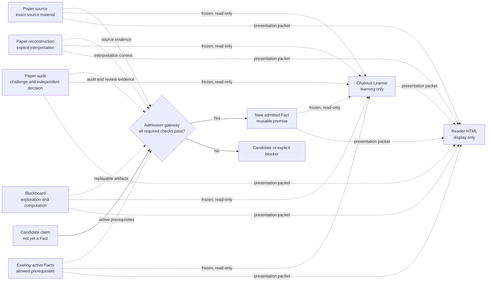

# Chalxius architecture

This is the deeper architectural reference. The main README now introduces the
features and mechanisms from first principles; use this page when you need the
full authority model, admission sequence, and correction semantics.

## What Chalxius is

Chalxius is one integrated system for four related jobs:

1. reconstructing and auditing research sources;
2. exploring claims, proofs, computations, and objections;
3. admitting verified claims into a reusable Fact Graph; and
4. teaching from frozen research material or presenting it in an offline
   Reader.

Chalxius contains one research engine. The engine records evidence and enforces
whether a candidate satisfies the system's admission rules. It does not declare
that a mathematical statement is infallible or absolutely true.

The teaching system and the Reader can consume research material, but they
cannot approve, repair, revoke, or write back a Fact.

## A small vocabulary

- A **node** is one recorded object, such as a source passage, interpretation,
  question, candidate claim, admitted Fact, or learning note.
- An **edge** records a named relation between two nodes, such as “depends on,”
  “replaces,” or “refutes.”
- **Authority** says what kind of evidence a node provides. A quotation, an
  experiment, an audit objection, and an admitted Fact have different
  authority even when their text looks similar.
- **Provenance** is the traceable origin of an object: its source, creator,
  exact content, and relevant prior objects.
- **Content-addressed** means identified by a fingerprint of exact bytes. If
  those bytes change, the fingerprint changes.
- A **snapshot** is an immutable, content-addressed view of a stored graph
  boundary at one moment. One snapshot may contain several authority classes.
- A **candidate** is a claim under consideration. A new capitalized **Fact** is
  a candidate that passed Chalxius's complete admission contract. An imported
  historical Fact keeps its earlier admission identity, recorded
  verification/admission level, and provenance rather than being silently
  recertified under the current contract.
- A **frozen verification package** is the exact, unchangeable material given
  to a verifier. A **fresh verifier** is a different review context that did
  not create the candidate.
- `truth_effect="none"` means an object can inform a person without changing
  the system's admitted research premises.

## Six authority classes

The central rule is simple: information keeps the authority of the process
that produced it.

| Authority class | Plain-language purpose | What its contents mean |
|---|---|---|
| Paper source | Preserve exact author text and source relations | Evidence of what the source says |
| Paper reconstruction | Record the researcher's explicit interpretation of the source | Candidate interpretation, not source text |
| Paper audit | Record independent objections, counterexamples, challenge decisions, and repairs | Audit evidence, not an admitted premise |
| Blackboard | Hold questions, plans, experiments, computations, obstacles, and candidate synthesis | Exploration only |
| Fact Graph | Hold admitted Facts and their active prerequisite relations | The only objects that may serve as trusted research premises |
| Learning | Hold teaching coverage, hints, misconceptions, practice, and mastery evidence | Learning evidence only; no truth effect |

The Reader uses one Paper label for Paper source and Paper reconstruction, then
keeps them distinct through their status labels. Paper audit remains a separate
Audit category. Display grouping does not merge their authority.

A Paper object copied to the Blackboard is still an exploratory mirror. An
Audit objection is still audit evidence. A correct answer in a lesson is still
learning evidence. None of these becomes a Fact merely because it looks
convincing.

## How the parts relate

Evidence and exploration can support an admission decision, but they do not
flow automatically into the Fact Graph. Only a candidate passes through the
admission gateway.

## How a candidate becomes a Fact

Chalxius does not approve a claim because an automated research worker sounds
confident. Admission requires all of the following:

1. The exact statement, proof, direct prerequisites, source evidence, task
   record, and submission are content-addressed.
2. Every direct prerequisite is an active admitted Fact rather than another
   unverified candidate.
3. The source is checked for its actual hypotheses, conventions, quantifiers,
   formulas, and applicability to the present claim.
4. Any load-bearing computation uses authorized immutable artifacts and can be
   independently replayed.
5. Jointly submitted dependent claims have no circular internal dependencies
   and become visible together or not at all.
6. A different fresh verifier checks only the frozen verification package.
7. The review, candidate bytes, verification package, gateway decision, and
   stored Fact are bound to one another exactly.
8. Revocation can cascade through dependents, and the current graph and
   workflow audits are clean.

If one requirement is missing, the result remains a candidate or an explicit
blocker. The system does not quietly lower the standard. “Fact” is therefore an
operational admission status inside Chalxius, not a claim of absolute
infallibility.

## What `fast`, `auto`, and `deep` change

| Profile | Exploration behavior | Fact-admission strength |
|---|---|---|
| `fast` | Expensive exploration is available but usually not automatic | Full and unchanged |
| `auto` | Deterministic workload signals activate the applicable tools; this is the default | Full and unchanged |
| `deep` | Every applicable expensive research feature must be completed | Full and unchanged |

`deep` explores more; it does not create a stronger kind of Fact. `fast` costs
less by default; it does not create a weaker kind of Fact. A mode switch affects
only work started after the switch. Work already frozen for execution keeps the
profile and content fingerprints with which it started.

## How corrections and historical nodes work

Chalxius preserves history rather than silently overwriting it. A mistaken
Paper reconstruction or Audit object is corrected by appending:

1. a typed challenge against the exact old object;
2. an independent decision that upholds, rejects, or repairs the challenge;
3. a replacement or repair object; and
4. an explicit relation such as `replaces`, `repairs`, or `refutes`.

A new reviewed snapshot becomes current while the old snapshot remains
available as historical evidence. A blocking unresolved challenge prevents
downstream reliance but does not erase the record.

Fact revocation is also explicit and can cascade to dependent Facts. Imported
historical Facts keep their original provenance and recorded
verification/admission level; changing one creates a new candidate that must
pass the current Chalxius contract.

## Chalxius Learner

Chalxius Learner is an optional academic teaching and testing surface inside
Chalxius. It starts only when the user explicitly asks to learn, be questioned,
study a paper, train for an exam, or record mastery.

It may read exact frozen Fact, Paper, and Blackboard snapshots. These mounts are
read-only and keep every source object's original authority, status, and
content hash. Learner notes cannot modify a research source and cannot enter
Fact admission. Persistent learning records require separate authorization.
Their `truth_effect` is always `none`.

## The offline Reader

The Reader turns a prepared packet into one self-contained HTML file. The
packet may include material from several authority classes, but it must preserve
each node's original class, status, exact mathematical text, edge direction,
provenance, and explicit reading order: theme order, target order, and each
target's prerequisite tie-break order.

Before export, Reader Finalize requires human-readable sidebar material for
every included node: summary, intuition, importance, and reasoning. This is a
presentation-readiness check, not a mathematical verification.

The renderer:

- makes no network request or model call;
- creates no second graph database;
- persists no research or interface state in browser local storage;
- writes nothing back to Paper, Audit, Blackboard, Fact, or Learning data; and
- always reports `truth_effect="none"`.

Export replaces only the fixed `visualizations/knowledge-map.html` file. The
Reader's Reload graph control navigates to that same file again, so the browser
loads the latest complete export and resets temporary interface state. File
replacement is atomic: the browser can see the complete old file or the
complete new file, never a half-written file. This is not a watcher or live
synchronization service.

## The invariants to remember

1. Chalxius contains one research engine and one Fact-admission contract.
2. Authority labels are safety boundaries, not decorative categories.
3. Only admitted Fact Graph nodes may serve as trusted research premises.
4. `fast`, `auto`, and `deep` change exploration cost, not truth standards.
5. Corrections and revocations preserve traceable history.
6. Learner and Reader outputs never flow back into Fact admission.

For exact technical contracts, see
[`unified_architecture.md`](chalxius/references/unified_architecture.md),
[`admission_contract.md`](chalxius/references/admission_contract.md),
[`reasoning_modes.md`](chalxius/references/reasoning_modes.md), and
[`reader_html_export.md`](chalxius/references/reader_html_export.md). For origin
and attribution, see [`ACKNOWLEDGEMENTS.md`](ACKNOWLEDGEMENTS.md).
For concrete, bounded examples with clickable Reader pages, see
[`USE_CASES.md`](USE_CASES.md).
