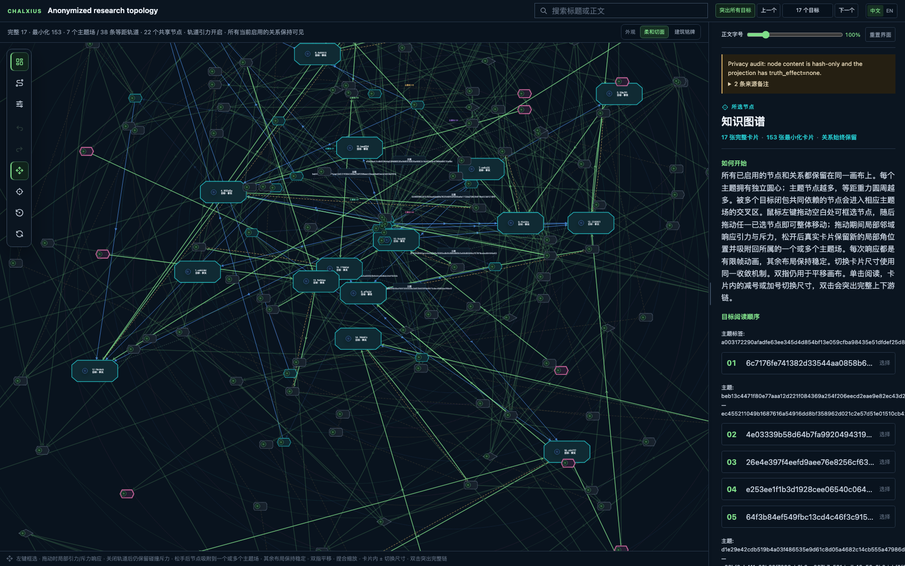
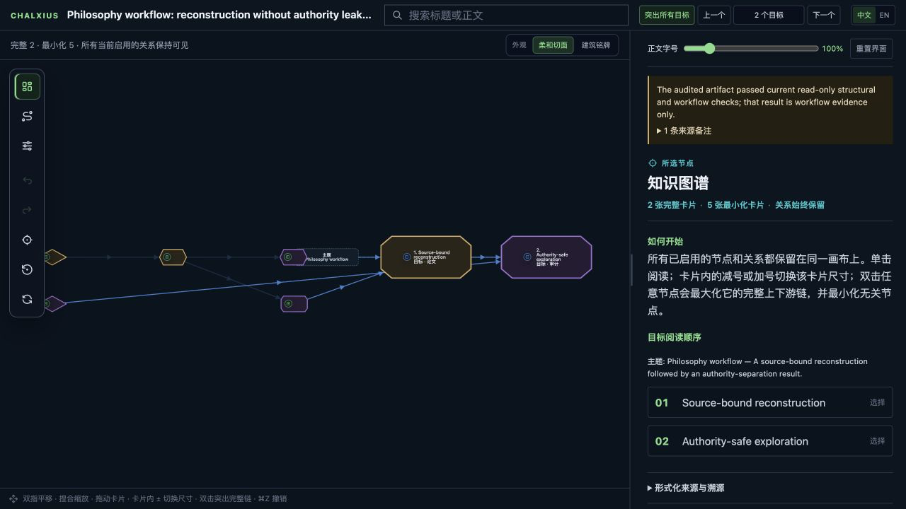
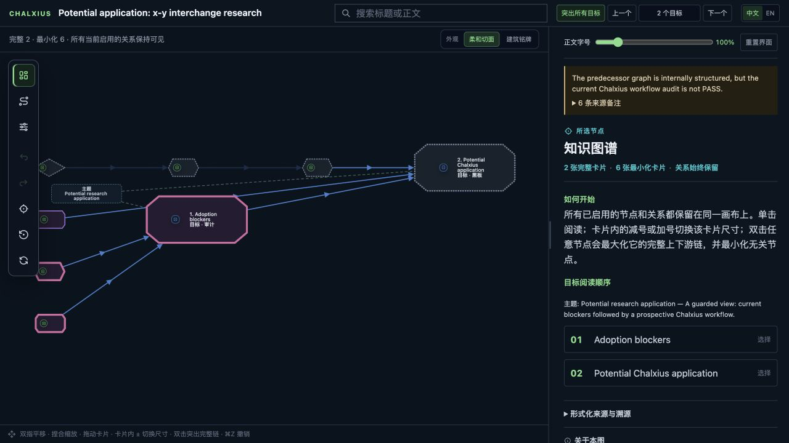

# 🧭 Chalxius

Chalxius helps researchers turn drafts, papers, proof ideas, computations, and
teaching goals into a working research graph that Codex can inspect, extend,
attack, verify, and present. Exploration stays useful; reusable Facts remain
explicitly verifier-gated.

**[🚀 Explore the live cases](https://cm4u7.github.io/chalxius/)** ·
[📚 Read the use cases](USE_CASES.md) ·
[📦 Download v0.8.6](https://github.com/cm4u7/chalxius/releases/tag/v0.8.6) ·
[✅ See validation](VALIDATION.md) ·
[🏗️ Architecture](ARCHITECTURE.md) ·
[🧾 Resolved CHX mechanisms](chalxius/KNOWN_LIMITATIONS.md)

## 🚀 Start with the interactive cases

These self-contained Reader pages are the quickest way to see the graph model.
Select cards, inspect exact detail, expand complete paths, and move around the
topology without changing any source or research authority.

| 🗺️ Working-scale topology | 📚 Philosophy workflow | 🧮 Graph of a proof |
|---|---|---|
| [](https://cm4u7.github.io/chalxius/cases/anonymized-research-topology.html) | [](https://cm4u7.github.io/chalxius/cases/philosophy.html) | [](https://cm4u7.github.io/chalxius/cases/xy-swap-potential.html) |
| Real run topology: 175 nodes, 364 edges, 17 targets, and 7 themes; every content-bearing field is anonymized. | Source-bound argument reconstruction, independent audit, correction, and authority separation. | A guarded visualization of computation, blockers, and revocation.  |

The featured graph uses opaque
HMAC-SHA-256 identifiers produced with a discarded ephemeral key; it preserves
structure, not private claims, formulas, names, or source locators.

## 🧰 What you can do with Chalxius

- 📄 **Research a draft from its Paper Graph.** Freeze the exact draft,
  decompose it into a proposition-total DAG, inherit every target and ordered
  premise, and strengthen it copy-on-write instead of replacing it with a tiny
  convenience Fact bundle.
- 📚 **Keep finished external papers as Evidence.** PDF bytes, DOI identity,
  peer review, and citations do not create Fact authority. Exact claims still
  need an explicit bridge, fresh verification, and ordinary admission.
- 🧩 **Develop or refute a mathematical target.** Preserve the exact
  conjecture, hypotheses, domains, quantifiers, and target ids; a valid result
  may be `proved`, `disproved`, or
  `unresolved_with_obstruction`.
- 🧠 **Run several lines of reasoning without mixing them.** Keep exploratory
  attempts, counterexamples, objections, repairs, and computations on the
  Research/Blackboard planes until their dependencies are visible.
- 🛡️ **Review Research before expensive packaging.** Each Research cycle first
  produces proof attempts, counterexamples, literature findings, computation
  plans, and reviewable core code; a second subround assigns focused supervisors
  to challenge the reasoning and program–math alignment before execution while
  the work remains on the Research plane.
- 🧮 **Make computation replayable.** Bind formulas, code, versions, domains,
  representations, checkpoints, outputs, and approximation budgets to the
  exact claim they support.
- 🔎 **Investigate sources and novelty.** Check publication identity, theorem
  applicability, locators, witnesses, conventions, nearby literature, and the
  bounded corpus behind a novelty statement.
- ✅ **Promote only reusable results.** The sole truth path remains
  `Research → Candidate Release → Certification Decision → Fact`.
- ♻️ **Correct without losing history.** Challenge, replace, refute, or revoke
  a node while preserving its old bytes and showing downstream impact.
- 🧾 **Learn from architecture failures.** Append-only CHX ledgers record every
  discovery before classification, preserve typed relations and predecessor
  runs, and gate public disclosure against the complete ordered ledger lineage.
- ⚡ **Query large Paper continuations without rescanning them.** Routine status
  reads one atomic content-addressed HEAD and immutable receipts. Full closure
  validation is explicit; stale directory generations fail closed instead of
  silently falling back to an expensive scan.
- 🪶 **Reuse expensive validation only when identity is exact.** Release-time
  mutation plans are checked before their baseline starts, and protected
  runtime cutover consumes a hash-approved project receipt. Unchanged project
  state is not audited twice; semantic drift still fails closed or triggers the
  one necessary deep audit.
- 🛰️ **Use only a cautious slice of Brave Future.** Under `auto` or `deep`, an explicit
  research objective can establish or reuse its exact prospective Campaign
  scope and project BF-1 without requiring Campaign jargon. BF-2/BF-3 still
  require real blockage evidence. None of these levels can plan rounds,
  dispatch agents, create Research, or affect Candidate, Certification,
  Gateway, or Fact.
- 🎓 **Teach from a frozen graph.** Chalxius Learner can explain, question,
  test, and schedule review without changing research state.
- 🗺️ **Publish a readable map.** Export one deterministic offline Reader with
  bilingual controls, MathJax, draggable cards, theme fields, and complete path
  exploration.

## 🧬 Preserve the research target, not one universal “stance”

The continuity rule is domain-indexed:

| Draft type | What stays exact | Legitimate outcomes |
|---|---|---|
| Philosophy | Declared argumentative direction, headline, required and forbidden claims | `preserved` or `strengthened`, unless the Operator authorizes an exact revision |
| Mathematics | Conjecture/question, hypotheses, domains, quantifiers, target claim ids | `proved`, `disproved`, or `unresolved_with_obstruction` |
| Empirical | Question, estimand, population, exposure/intervention, outcome, scope | supported, disconfirmed, or inconclusive |
| Mixed | At least two explicit component adapters and their shared target ids | The composed outcomes of those exact adapters |

A counterexample to an unchanged mathematical conjecture is target-preserving.
A proof of a weakened or re-quantified theorem is not a resolution of the
original target merely because it points in the same direction.

## Architecture in one minute

```text
frozen sources ──► Paper Logic ──► independent Audit ──► Evidence
                         │                                │
                         └────────► Research ◄────────────┘
                                      │
                         Blackboard / computation / adverse work
                                      │
                                      ▼
                              Candidate Release
                                      │
                              fresh Verifier
                                      │
                                      ▼
                           Certification Decision
                                      │
                               Fact Gateway
                                      │
                                      ▼
                                  Fact Graph
```

Main explores, compiles task context, and decides bounded future attack routes.
Operator governs explicit activation, overrides, imports, and prospective route
disablement. Host is a narrow dispatch/status/audit
boundary. Workers contribute bounded Research. Paper Auditor, Verifier, and
Gateway remain separate so the same actor cannot silently explore, certify, and
admit its own result.

Historical projects and old Evidence remain readable. Reading them does not
transfer their authority into a new V5 project, and upgrading Chalxius never
forces running work to restart under a newer contract.

## Install and verify

Download these adjacent release assets:

- `chalxius-0.8.6-bounded-phx-repair.tar.gz`
- `chalxius-0.8.6-bounded-phx-repair.tar.gz.sha256`

Then run:

```sh
shasum -a 256 -c chalxius-0.8.6-bounded-phx-repair.tar.gz.sha256
tar -xzf chalxius-0.8.6-bounded-phx-repair.tar.gz
cd chalxius
shasum -a 256 -c MANIFEST.sha256
```

The unpacked [`chalxius/`](chalxius/) directory is the installable skill. A
replacement of an installed copy is a separate cutover decision; do not replace
the runtime beneath an already-frozen task card.

<a id="prompt-interface"></a>

## User prompt interface

You normally do **not** need to know any CLI command. Invoke the system by naming
`$chalxius` (most explicit) or `Chalxius`, then describe the object, action,
boundary, and desired output in ordinary Chinese or English.

```text
Use $chalxius + [mode] + [subject] + [action] + [boundaries/output]
```

For example:

```text
Use $chalxius in auto mode to study this paper，continue from established Paper Graph，
```

```text
Use $chalxius in deep mode to compare independent proof routes, replay the
load-bearing computation, and prepare only verifier-ready claims for release.
```

### Reasoning modes 

| Say this | Effect |
|---|---|
| `用 Chalxius` / `Use $chalxius` | Starts in `auto`, the default |
| `快速模式` / `fast mode` | Narrow, low-cost exploration; evidence and Fact gates remain unchanged |
| `自动模式` / `auto mode` | Activates only the expensive capabilities indicated by the task |
| `深度思考` / `deep mode` | Broad source, route, computation, novelty, and specialist planning when applicable |
| `从现在切换到…` / `switch future work to…` | Changes future work units only; frozen rounds are not restarted |

### What to say for each feature 

| You want | Natural-language command examples |
|---|---|
| Ordinary proof research | `用 Chalxius 研究这个命题，先列出目标闭包和缺失前提，再比较证明路线。`<br>`Use $chalxius to build the target closure and compare proof routes.` |
| Build and audit a Paper Graph | `用 Chalxius 对这篇论文建立 Paper Graph，逐节点绑定原文、定义、量词和依赖，再交给独立 paper auditor。` |
| Strengthen a research draft | `把这个研究中草稿拆成完整 DAG；以 Paper Graph 为研究基底，逐节点做 Fact 准入、补强和反驳检查，不要压缩成少量 convenience Facts。` |
| Resolve an exact mathematical target | `保持这个猜想的假设、定义域和量词不变；证明或证伪它。若都做不到，返回可核验的 obstruction，不要改成更弱命题。` |
| Continue from a reviewed paper | `从这个已审查 Paper Graph 继续研究，不要退回只读论文；保持每个 Research 节点与 Paper target 的绑定。` |
| Archive paper Evidence | `把审查完成的 Paper Graph 连同论文版本和 PDF 保存到跨项目 Evidence 仓库。`<br>When a library is configured, a reviewed immutable freeze syncs automatically. |
| Import a non-paper Fact Graph as Evidence | `把 /path/to/fact_graph 作为非论文 Fact Graph 显式导入 Evidence；不要继承它的 Fact 权威。` |
| Bridge Evidence into the current project | `选择这些 Evidence 节点建立 verified bridge，列出所有 stale/correction 风险，再走新的 verifier 和 Fact Gateway。` |
| Correct a Paper/Evidence graph | `这个 Paper Graph 节点有误：追加修正、标记旧图 stale，并报告所有 bridge 和本地 Fact 的影响；不要静默重写。` |
| Program–mathematics attack | `对这段公式到代码的投影做数学-程序一致性攻击，检查截断阶数、表示、定义域、误差预算和独立重放。` |
| Goal-driven advisory scope | `用 Chalxius 自动模式或 deep 模式研究这个目标……`<br>The explicit objective is enough: `auto` or `deep` can establish the exact internal scope and project BF-1 without asking you to say “Campaign”. |
| Cautious Brave Future reassessment | `对这个显式激活的 Campaign 做一次 BF-2 dry-run reassessment；若我随后明确批准，只写一份 BF-3 advisory receipt，不要计划轮次或派发 worker。` |
| Adverse review | `对这个结论做 hostile/refute 审查；任务结束时给我成功或有价值的 Attack report 和规则进化建议，但不要自动采用。` |
| Philosophy-only attacks | `这是哲学论证。启用普通语言替换、举证责任、最强善意反驳、独立失败面，以及量词/模态/范围/例外等价性攻击。` |
| Review route evolution | `汇报本轮攻击发现和 Main 的抽象处置；不要把 worker 文本直接写成规则。` / `停用规则 R…` |
| Prepare a certified Fact | `把这些 Research 封装为 Candidate Release，交给新的 verifier；只有完全一致的接受决定才能进入 Fact Gateway。` |
| Export the interactive Reader | `把当前图导出为单文件 Reader HTML；每个节点补齐摘要、直觉、重要性、推理路线和来源。` |
| Generate project background | `为这个项目生成（或刷新）PROJECT_BACKGROUND.md，并把它压成可检索索引。` |
| Teach or test you | `用 Chalxius Learner 根据这个冻结图教我/考我，一次一个问题，不要修改研究图。` |
| Diagnose Chalxius architecture | `读取这个 chx-ledger，修复其中由 Chalxius 架构造成或显著放大的问题，不要把它们加入攻击路由。` |

Chinese and English may be mixed freely. Paths, exact targets, source versions,
required outputs, and “do not …” boundaries can be written in the same ordinary
sentence; there is no separate prompt DSL.

### Default versus explicit behavior

Once `$chalxius` is invoked for a new governed V5 task:

- `auto` is selected unless you say `fast` or `deep`;
- an explicit research objective under `auto` or `deep` may establish or exactly reuse
  its prospective internal Campaign scope and project advisory BF-1; this does
  not plan or dispatch work;
- a task-scoped CHX ledger is opened and closed; it is reported only if a
  qualifying architecture issue exists;
- a task-end Attack report is produced, including an explicit zero report when
  no productive attack survives;
- a reviewed immutable Paper Graph is copied to the configured Evidence library
  with its exact paper version and PDF; sync failure is visible and retryable.

The following actions always require explicit language from the user:

- importing a non-paper Fact Graph into Evidence;
- overriding or disabling an adverse route outside Main's bounded decision;
- generating or refreshing project background;
- starting Chalxius Learner or a Reader export, and manually activating or
  changing Campaign state beyond exact `auto`/`deep` goal intake;
- sealing a Candidate Release or attempting Fact admission;
- migrating or replacing an active project/runtime.

If you ask only for a “node graph” without naming Chalxius or another graph
implementation, the host asks which implementation you mean. Academic “teach
me / test me / grill me” language invokes Chalxius Learner; programming
requirements or debugging language refers to the separate Grill Me Code tool.

## Internal role boundaries

Users normally describe the desired outcome rather than choosing an internal
role. Chalxius binds every low-level operation to one explicit role:

| Role | May do | Must not do |
|---|---|---|
| `operator` | Initialize governance, switch modes, import Evidence, disable routes, perform explicit overrides | Approve worker reports as route policy or treat governance as mathematical verification |
| `main` | Inspect sources and graphs, plan Research, compile context, decide bounded future attack routes, query Evidence, prepare releases and Readers | Certify its own release or bypass the gateway |
| `host` | Trusted dispatch, task status, and bounded audit transport | Read background for exploration, plan mathematics, or gain proof authority |
| `worker` | Execute one immutable task card and return bounded Research/artifacts | Infer capabilities from filesystem access or write Facts |
| `paper-auditor` | Independently review Paper Logic and correction coverage | Turn interpretation into source authority |
| `verifier` | Review one frozen verifier capsule and issue an immutable decision | Explore the live project or admit a Fact |
| `gateway` | Recheck the exact accepted decision and expose the admitted Fact | Repair a proof, waive evidence, or reinterpret the decision |

## Machine CLI (advanced)

<details>
<summary>Open the low-level command-family reference</summary>

Set explicit paths; Chalxius never guesses a project root inside the skill:

```sh
MGRAPH=/absolute/path/to/chalxius/scripts/mgraph
PROJECT=/absolute/path/to/my-project

"$MGRAPH" --root "$PROJECT" --role operator init \
  --project-id my-project \
  --title "My research project" \
  --workflow-version 5 \
  --reasoning-mode auto

"$MGRAPH" --root "$PROJECT" --role main status
"$MGRAPH" --root "$PROJECT" --role main audit
```

Run `mgraph --help` for the complete parser and
`mgraph ... COMMAND --help` for exact fields. The stable command families are:

| Interface | Commands |
|---|---|
| Project and mode | `init`, `status`, `audit`, `mode-init`, `mode-status`, `mode-switch`, `upgrade-project-copy`, `upgrade-workflow` |
| Fact inspection | `show`, `search`, `closure`, `context`, `targets`, `set-targets`, `fact-graph-inventory`, `fact-graph-append-target`, `revoke` |
| V5 release and admission | `candidate-release`, `candidate-release-check`, `verifier-capsule`, `certification-record`, `certification-decision-check`, `fact-admit` |
| Atomic mini-DAG admission | `fact-bundle-submit`, `make-bundle-verifier-task`, `fact-bundle-record-review`, `fact-bundle-admit` |
| Research and frontier | `memory-add`, `memory-update`, `frontier`, `adoption-plan`, `plan-round`, `plan-repair-round`, `round-status`, `work-unit-abort` |
| Worker boundary | `preflight-return`, `validate-return`, `ingest-return`, `make-verifier-task` |
| Paper Logic and Audit | `paper-logic-init`, `paper-logic-stage`, `paper-logic-record-review`, `paper-logic-freeze`, `paper-logic-status`, `paper-logic-show`, `paper-logic-query`, `paper-logic-audit`, `paper-logic-link-exploration`, `paper-logic-project-blackboard` |
| Paper continuation | `paper-continuation-plan`, `paper-continuation-status` (bounded by default; explicit `--full`), `paper-continuation-status-index-rebuild`, `paper-continuation-dispose` |
| Cross-project Evidence | `evidence-library-status`, `evidence-query`, `evidence-sync-retry`, `evidence-import-fact-graph`, `evidence-bridge-prepare`, `evidence-bridge-check`, `evidence-mark`, `evidence-impact-report` |
| Blackboard | `blackboard-type-register`, `blackboard-space-create`, `blackboard-node-add`, `blackboard-edge-add`, `blackboard-show`, `blackboard-query`, `blackboard-snapshot`, `blackboard-snapshot-query`, `blackboard-reindex`, `blackboard-promote-node` |
| Campaign and goal intake | `research-goal-intake`, `campaign-create`, `campaign-activate`, `campaign-update`, `campaign-status`, `campaign-target-add`, `campaign-target-archive`; scoped `frontier --campaign` and `plan-round --campaign` |
| Collaboration Pulse | `pulse-plan`, `pulse-barrier`, `pulse-dispatch`, `pulse-close`, `pulse-status`, `pulse-audit`, `pulse-void`, `pulse-abort` |
| Replayable experiment | `experiment-start`, `experiment-event`, `experiment-observe`, `experiment-decision`, `experiment-resume`, `experiment-status`, `experiment-finalize` |
| Adverse governance | `attack-route-enable`, `attack-route-status`, `attack-report`, `attack-route-decide`, `attack-route-disable` |
| Claims and exposition | `claim-add`, `claim-variant`, `claim-show`, `convention-add`, `convention-show`, `export-claim-card`, `lint-expert-document`, `export-interpret-card`, `lint-interpret-document` |
| Novelty and migration | `novelty-record`, `novelty-status`, `import-danus` |
| Presentation | `export-mermaid`, `export-reader-html --packet ...`, `export-reader-html --v5-projection` |
| Background index | `project-background-index`, `project-background-read` |

Compatibility commands such as `submit`, `packet`, `record-review`, `admit`,
and `profile-closure-*` remain available for bounded historical workflows. They
do not replace the V5 release/certification/gateway path.

</details>

## Paper Graph and Evidence lifecycle

For paper-led work, Chalxius binds research to an exact reviewed Paper snapshot
instead of treating a prose summary as sufficient context:

1. Freeze the exact paper version and PDF.
2. Stage source nodes, reconstruction nodes, typed edges, and target closure.
3. Obtain an independent Paper Audit and freeze the reviewed graph.
4. When an Evidence library is configured, archive the exact paper version,
   PDF, graph, and review attestation automatically.
5. Continue Research from selected Paper targets; report Paper adequacy
   separately from Fact validity.
6. If later correction marks Evidence stale, compute bridge and local-Fact
   impact without silently rewriting or revoking authority.

Non-paper Fact Graphs are different: importing them into Evidence requires an
explicit user request and the `operator` role. Older supported V5 graphs can be
audited and imported without reopening their completed work. A destination
project may use selected Evidence only through a content-addressed
`verified_bridge`, which is rechecked during release, verification, and Fact
admission.

The release includes the native local `paperlib` runtime; Zotero is not
required. Chalxius can initialize an explicit cross-project library root and
store append-only metadata, exact PDF versions, Paper Graph trees, corrections,
and rebuildable JSON/SQLite indexes there. It never stores library data inside
the installed skill.

See [`evidence_plane.md`](chalxius/references/evidence_plane.md),
[`paper_input_contracts.md`](chalxius/references/paper_input_contracts.md), and
[`paper_continuation_contract.md`](chalxius/references/paper_continuation_contract.md)
for exact schemas and failure behavior.

## Attack reports and CHX reports

These are deliberately separate:

- The **Attack report** records successful counterexamples and other productive
  challenges as concrete evidence. New governed V5 tasks produce a report even
  when it is explicitly zero. Main alone may abstract that evidence into a
  compact future mechanism-level rule; workers do not draft persistent policy.
- The **CHX architecture report** contains only failures caused or materially
  amplified by Chalxius architecture. A run with no qualifying issue stays
  silent. CHX issues are repair inputs for Chalxius and are never learned as
  mathematical attack rules.

The general route includes hidden-conjunct splitting. Philosophy-only routes
add plain-language replacement, burden/strongest-charitable-objection/
independent-failure-surface attacks, and quantifier–modal–scope–exception
equivalence checks. Exact frozen domain metadata—not keywords—controls whether
the philosophy set is available.

## Reader interface

`export-reader-html` atomically replaces exactly:

```text
PROJECT/visualizations/knowledge-map.html
```

Reader revision 20 provides:

- hash6 plus role/plane canvas identities, with full exact material in the detail panel;
- MathJax rendering in summaries and formal detail;
- one center per theme, concentric topic orbits, and shared-node placement in overlap regions;
- simultaneous local attraction and repulsion, even when topic orbits are disabled;
- radial and angular memory springs that preserve the initial layered circular composition;
- pinned selected/path/topic anchors during local settlement;
- draggable and resizable cards, pan/zoom, undo/redo, filters, search, and complete-chain expansion;
- a deterministic offline single file with no fetch, watcher, storage writeback, or graph mutation.

Reader Finalize fails closed if any included node lacks summary, intuition,
importance, reasoning, formal detail, or provenance. A successful export proves
presentation readiness only.

## Rebuild the public demos

The two guided packets and all three HTML pages are deterministic:

```sh
python3 examples/build_case_demos.py
python3 examples/validate_public_examples.py
```

To create a content-free public topology from your own private Reader packet and
project run:

```sh
python3 examples/anonymize_reader_topology.py \
  --reader-packet /private/path/reader-packet.json \
  --project-root /private/path/project \
  --output examples/reader-packets/my-anonymized-topology.json
```

Without `--key-file`, the script generates and discards an ephemeral 256-bit
key. It fails if the output is inside the source project, if a source identifier
or source text survives, or if any node content field is not a 64-character
hash. Supplying a private key file enables repeatable mapping, but that key must
never be published.

## v0.8.6: Bounded PHX Repair

Main now selects load-bearing Research and exact canonical Candidate Fact
bytes directly. Planning creates immutable cards but does not count as
dispatch; Main launches and confirms workers through the ordinary host
interaction. Author, worker, and container provenance remains lineage rather
than a mathematical capability gate.

Candidate and verifier work now share only a command-local immutable
inspection context. Transient canonical-return visibility races are retryable
without false quarantine, while unsafe or malformed bytes still fail closed.
Role-aware help preserves the same authorization boundary, with Gateway as the
sole owner of Certification publication and Fact admission.

On the same local-F0 fixture, the successful Candidate path fell from about
91.7 seconds to 12.80 seconds, verifier capsule generation from about 134
seconds to 6.35 seconds, and host materialization from about 210 seconds to
6.72 seconds, with semantic ids unchanged. These are Main-visible diagnostic
observations, not thresholds; no timer, watcher, daemon, or persistent
performance state was added.

This release is cumulative from public 0.8.0 and includes the 0.8.1 through
0.8.5 scoped-adversity, exact-route, canonical-handoff, semantic-handoff, and
terminalized-worker changes. The exact 256-entry manifest passed the routine
matrix, 175 repair regressions, all 15 semantic mutants, 102 feature probes,
strict architecture reconnaissance, deterministic archive build, and cold
verification.

## v0.8.0: MathGraph First

The MathGraph is now the forward-compatibility surface. Valid node and edge
hashes, dependencies, provenance, workflow stages, and owner boundaries let
agents operate legacy and current graphs directly across runtime upgrades.
Runtime locations, archives, migration ceremonies, and ordinary
worker-ingestion receipts are diagnostic or process provenance rather than
ordinary graph-operation gates.

The retired runtime-compatibility closure and its adapter/migration path are
removed. A complete hash-bound Research product with valid assignment
provenance remains consumable even when a derived worker receipt is absent.
Malformed graph hashes, missing dependencies, wrong-stage or owner/hash drift,
Candidate adverse review, verifier, Certification, Gateway, and Fact
authority checks remain at their owning boundaries.

The exact 253-entry manifest passed the routine matrix: changed-surface
tests 28/28, semantic mutations 15/15, graph/runtime focus 35/35, self-test,
strict architecture reconnaissance, cold archive verification, and
cache/bytecode checks. The installed 0.8.0 tree matches the validated
candidate. No Candidate, Certification Decision, Gateway admission, or Fact
was created by this architecture release.

## v0.7.16: Bounded Capability Hygiene

Repair capabilities now use one exact command-local inspection context with a
64 MiB aggregate byte cap, no-follow reads, and mandatory invalidation across
mutation boundaries. Terminal worker bundles become the sole post-ingest
authority, gated textual artifacts reject unsafe C0 control bytes, and public
read paths suppress bytecode before local imports without creating lock files
or project state.

Fact search reuses one freshly validated active-Fact projection per read-only
command. Project CHX inventory accepts fully closed parallel successor chains
as separate RUN_ID-qualified histories while still rejecting active, drifted,
cyclic, missing, unsafe, or competing-supersedes branches. The public CHX
disclosure remains continuous through CHX-035; later project-local ledgers are
private nontruth evidence and are not distributed.

The exact 253-entry manifest passed all six release lanes, 942 tests, and all
145 registered mutants. The deterministic 254-member archive passed a fresh
253/253 manifest check, self-test, cache/bytecode hygiene, and the standard
skill quick validator with PyYAML 6.0.3. No Candidate, Certification Decision,
Gateway admission, or Fact is created by this architecture release.

## v0.7.15: Research Obligation Closure

A valid, non-aborted production ingestion receipt now closes only its source
Research obligation in the generic frontier. Pending, quarantined, invalid,
aborted, differently bound, and worker-result Research remains visible. A
fresh final-lock recheck prevents a receipt completed after selection from
creating a duplicate public round.

Explicitly Main-originated unbound Research is also idempotent when every
normalized semantic field except actor is identical. Ordinary, Operator,
task-bound, assignment-bound, historical, and semantically distinct writes
remain actor-sensitive; actor display text never grants Main authority.

This release publishes the validated local successor line after v0.7.4,
including compact role bootstraps, selective Fact-readiness batching without
automatic atomization, early Candidate work elimination, command-local
inspection reuse, and protected receipt-bound runtime cutover. The exact
251-entry manifest passed all six release lanes, 889 tests, and all 148
registered mutants. The A-model workload remains nontruth Research: no
Candidate, Certification Decision, Gateway admission, or Fact was created.

## v0.7.4: Bounded Main Routing

Attack workers now return concrete failure evidence and success boundaries,
while Main alone decides whether a reusable mechanism-level route is justified.
Current persistent rules use English internal prose, hard semantic-size limits,
semantic compression instead of truncation, and at most sixteen active rules
per project and per newly frozen card.

Compact production and supervision workers also have a first-output checkpoint:
after exact startup, the next milestone is one durable artifact or one explicit
blocker. Repeated status-only drafting may be reclaimed without adding a
watcher, timer, lifecycle state, audit, packaging gate, or truth gate. The
public CHX lineage now covers CHX-001 through CHX-022.

## v0.7.3: Selective Startup

Current Research production, Research supervision, and Chalxius Learner
document editing now start from compact, manifest-bound role bootstraps. Exact
Research objectives project their own frontier directly; broad historical
protocols load only when the frozen card or a newly observed event requires
them. Logical subround ordering and every Candidate, verifier, Certification,
Gateway, and Fact boundary remain unchanged.

Failure-informed work elimination now happens before pipeline construction:
stale dispositions fail before design reconstruction, one-off computations are
screened for information value, unsupported negative source-status claims are
removed or marked unresolved, and empty or explicitly excluded worker CHX
observations remain silent. Repair mode survives abort and replan, with the
final write-lock revalidation retained.

The public architecture lineage explicitly covers CHX-001 through CHX-020,
including the separate Learner startup workload and ownership of an excluded
nonarchitectural issue. The final matrix passed all 844 tests, all 148
registered mutants, 30 behavioral features, strict architecture
reconnaissance, self-test, lane isolation, and candidate nonmutation.

## v0.7.0: Failure-Informed Efficiency

Prospective production now excludes dedicated `refute` assignments. Exact
frozen outputs are reviewed in the second logical subround by at most three
supervisors selected from four reproduced failure families. Independent logical
components may progress concurrently, admitted Facts are not default
counterexample targets, and program code is reviewed before execution.

Routine overhead is narrower: plain interpretive insight no longer receives
blanket proof review, integration is reserved for cross-primary components,
the default Blackboard capability is one root node with no writes, and new V5
Pulse planning is retired while historical compatibility remains. Candidate
supervision and fresh-adverse failures are rejected before expensive packaging.

The field integration also bounds Paper-continuation ancestry reads, provides
typed active Fact-closure authority, preserves proof-risk signals for selective
supervision, and repairs immutable CHX successor disclosure. Five focused
release-only probes protect these observed failures without adding a normal
runtime gate.

The final manifest-bound matrix passed all 838 tests, all 147 registered
mutants, the behavioral feature gate, architecture reconnaissance, self-test,
exact lane isolation, and nonmutation. See [`RELEASE.md`](RELEASE.md),
[`VALIDATION.md`](VALIDATION.md), and
[`v5_release_traceability.md`](chalxius/references/v5_release_traceability.md).

## Scope and acknowledgements

- Software validation establishes package and workflow properties, not a mathematical theorem.
- A copied paper, successful computation, audit receipt, Reader page, or Evidence object is not an admitted Fact.
- Private QA material, original content from the anonymized showcase, credentials, and user-specific learning profiles are excluded from the public package.

Chalxius acknowledges the authors of **Danus: Orchestrating Mathematical
Reasoning Agents with Fact-Graph Memory** (Liu et al., arXiv:2607.06447v2),
whose public design informed the fact-graph layout, and **Matt Pocock** for the
public `/grill-me` requirements-interview design that informed Reader
requirements work. Neither is a runtime dependency. See
[`ACKNOWLEDGEMENTS.md`](ACKNOWLEDGEMENTS.md).

Licensed under Apache-2.0. Third-party notices and vendored component licenses
are included in the skill directory.
